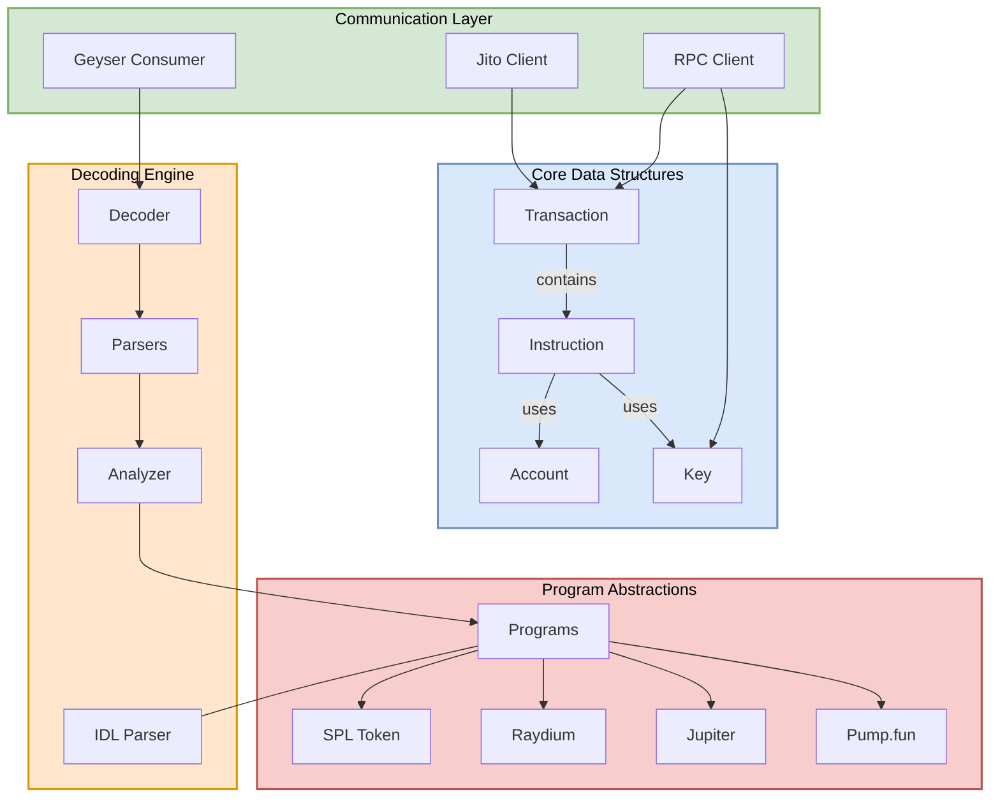
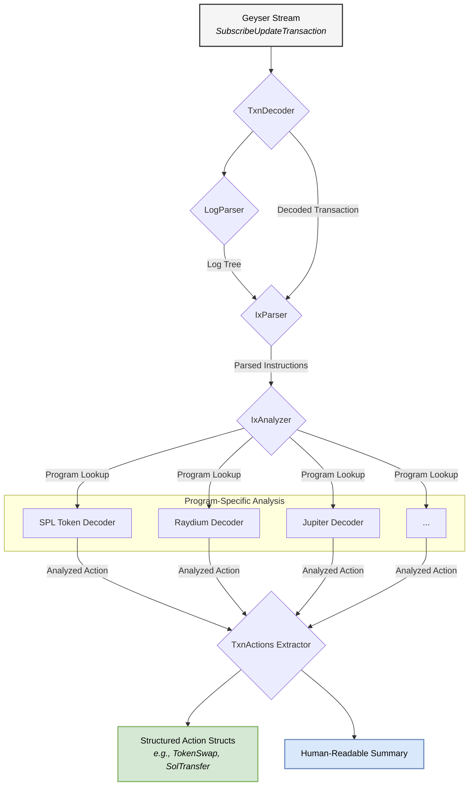

### High-Level Architecture

This diagram provides an overview of the main components of the library and how they relate to each other. It shows the core data structures, communication layers (RPC, Geyser, Jito), the decoding engine, and abstractions for on-chain programs.

-----

### Transaction Decoding Flow

This diagram illustrates the step-by-step process of how a raw transaction from a Geyser stream is parsed, decoded, analyzed, and ultimately converted into structured, human-readable actions.

