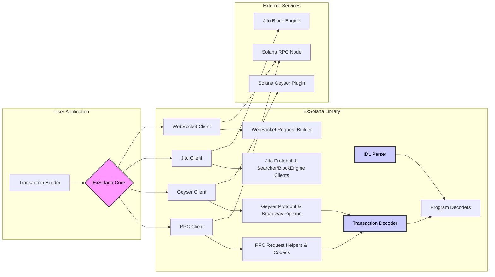
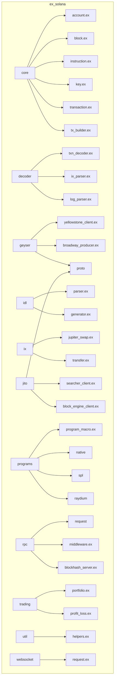
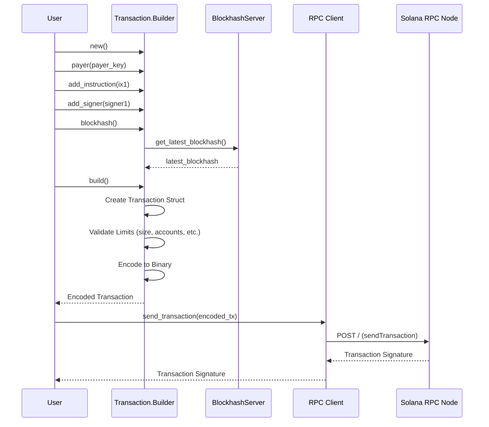
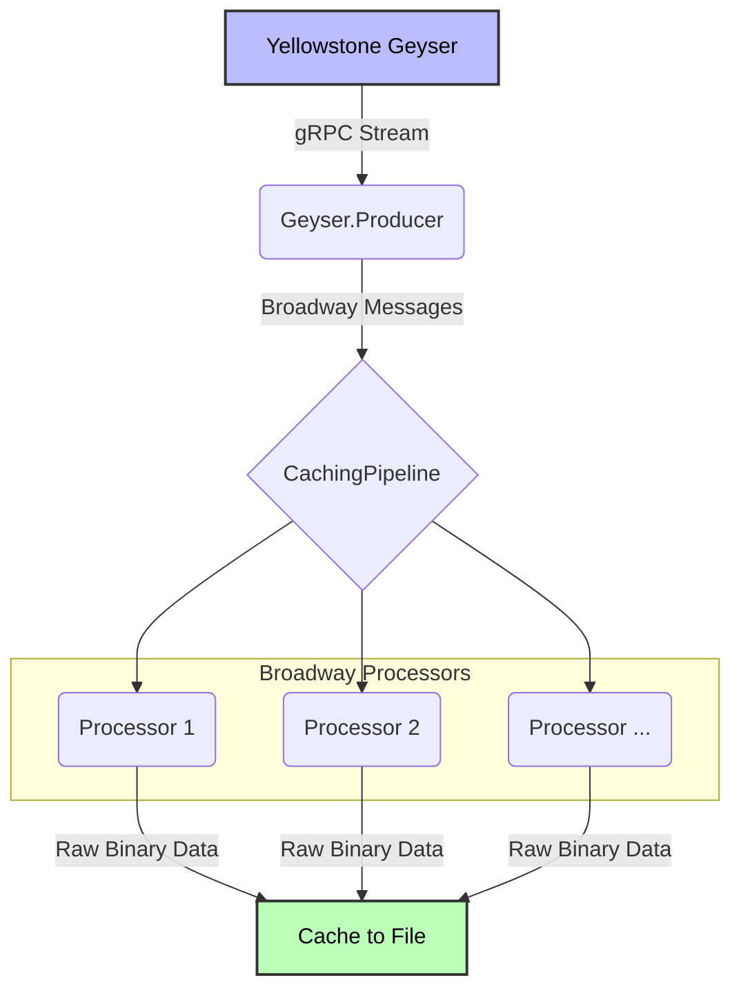
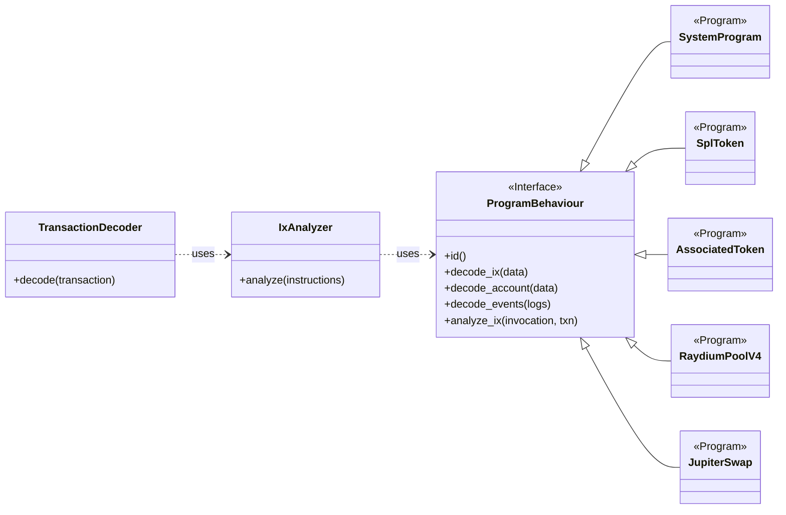
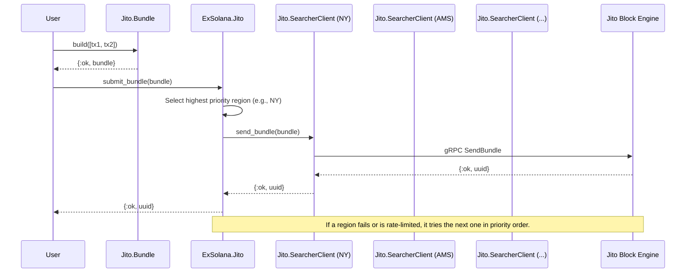

### 1. High-Level Architecture

This diagram provides a top-level overview of the main components of the `ExSolana` library and how they interact with each other and the Solana blockchain.

### 2. Directory Structure

This diagram illustrates the folder hierarchy of the `ex_solana` repository, giving a clear view of how the files are organized.

### 3. Transaction Building Flow

This sequence diagram shows the steps involved in creating, signing, and sending a transaction using the `Transaction.Builder`.

### 4. Geyser Data Processing Pipeline

This diagram illustrates the flow of data from the Yellowstone Geyser service through the Broadway processing pipeline.

### 5. Program Interaction and Decoding

This class diagram shows the relationship between the `ProgramBehaviour` module and its various implementations for different on-chain programs. It also shows how the transaction decoder utilizes these program-specific modules.

### 6. Jito Bundle Submission Flow

This sequence diagram outlines the process of creating a Jito bundle and submitting it to the Jito Block Engine via the available regional clients.

