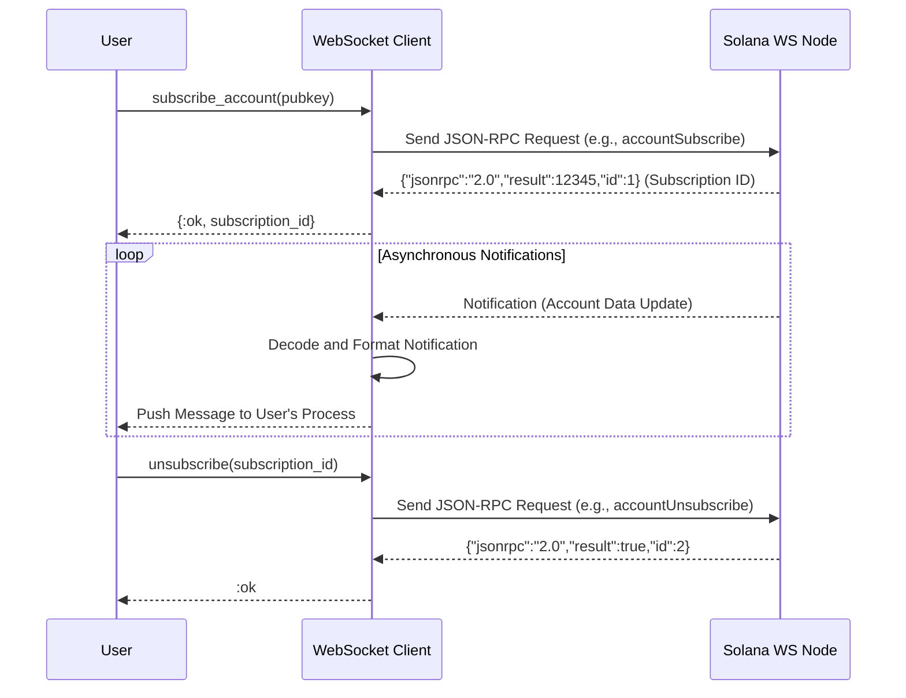
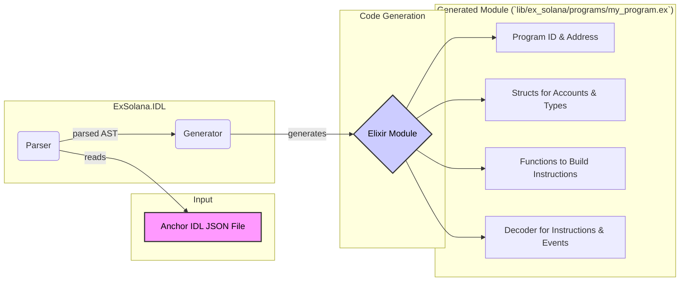
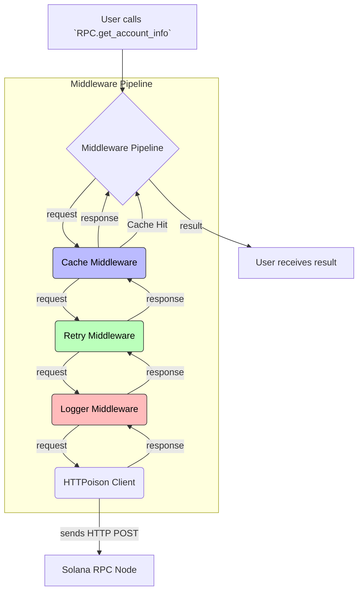
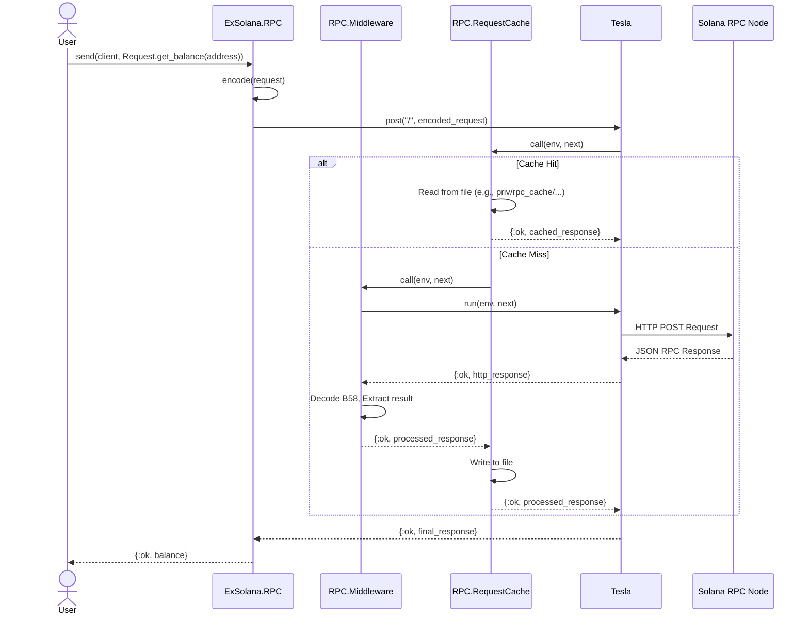
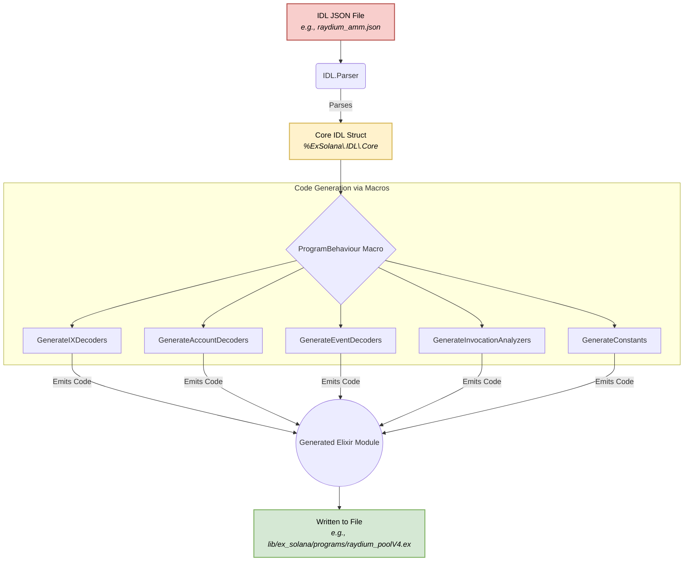

### 7\. WebSocket Subscription Flow

This sequence diagram details the process of a user subscribing to on-chain events, like account updates or log messages, via the WebSocket client. It shows the initial subscription request and the subsequent asynchronous notifications from the Solana node.

-----

### 8\. IDL to Elixir Module Generation

This diagram illustrates the workflow of the IDL parser and code generator. It shows how a Solana program's IDL (in JSON format) is processed to automatically generate a corresponding Elixir module, complete with type definitions and instruction encoders/decoders. This is a crucial part of the developer experience for integrating new programs.

-----

### 9\. RPC Request Middleware Pipeline

This diagram shows how an RPC request passes through a series of middleware modules before being sent to the Solana node. This architecture allows for cross-cutting concerns like caching, retries, and logging to be handled in a clean, composable way.

Of course. The two diagrams you created provide an excellent high-level overview and a detailed look into the transaction decoding pipeline. To complement them, here are two more diagrams that illustrate other crucial aspects of the `ex_solana` library: the **RPC request lifecycle** and the **IDL-to-code generation process**.

### 1. RPC Request Lifecycle

This sequence diagram details how the library handles an outgoing RPC request, such as fetching an account balance. It illustrates the flow through the middleware stack, including how the optional caching layer intercepts requests to avoid redundant network calls.

### 2. IDL-to-Code Generation Workflow

This flowchart explains the process of converting a Solana program's IDL (Interface Definition Language) from a JSON file into structured, usable Elixir modules. This is a key feature for developers building on top of `ExSolana`, as it automates the creation of program-specific decoders and analyzers.

